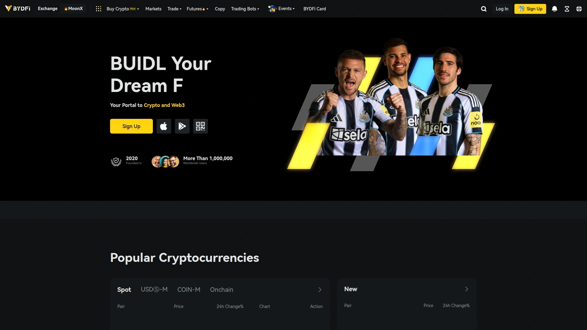
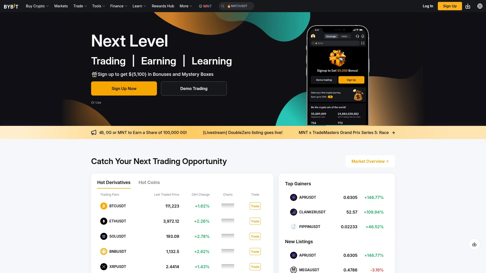
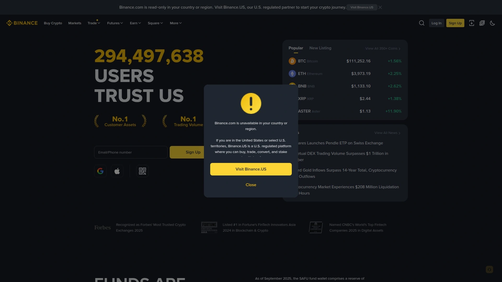
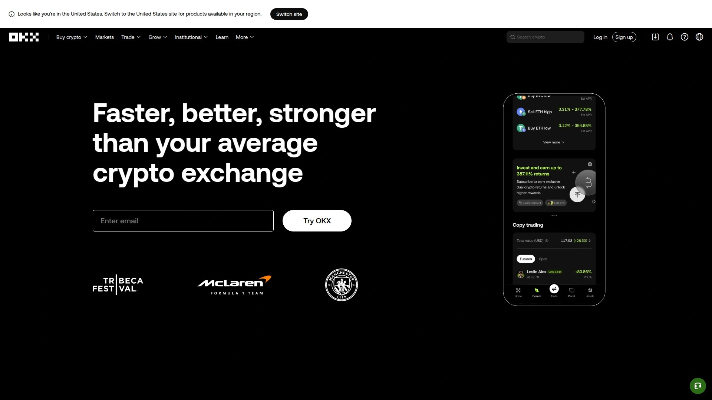
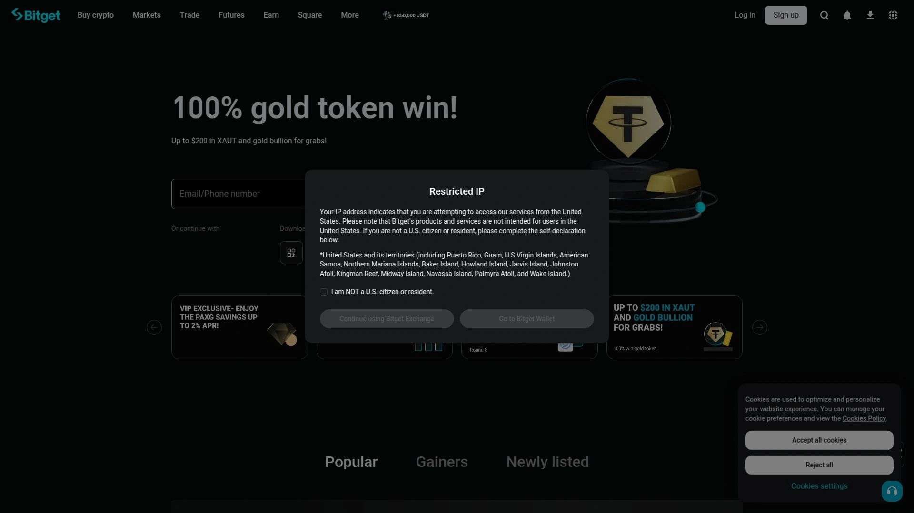
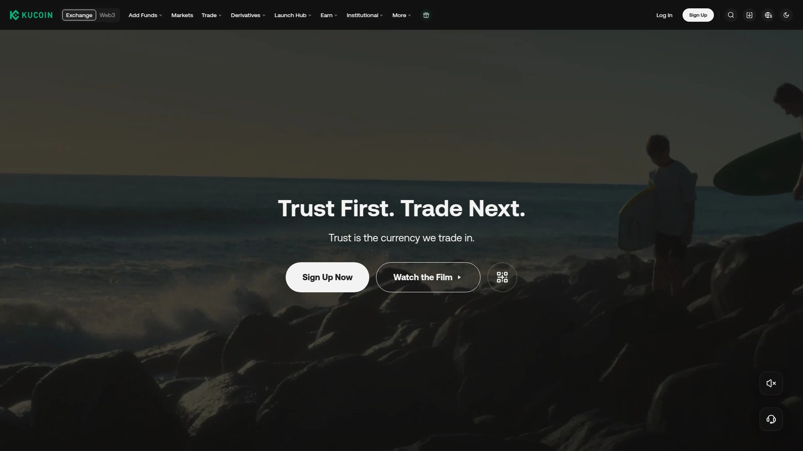
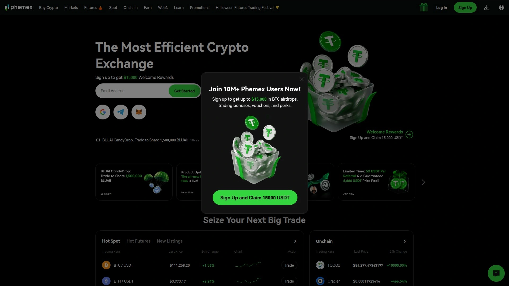
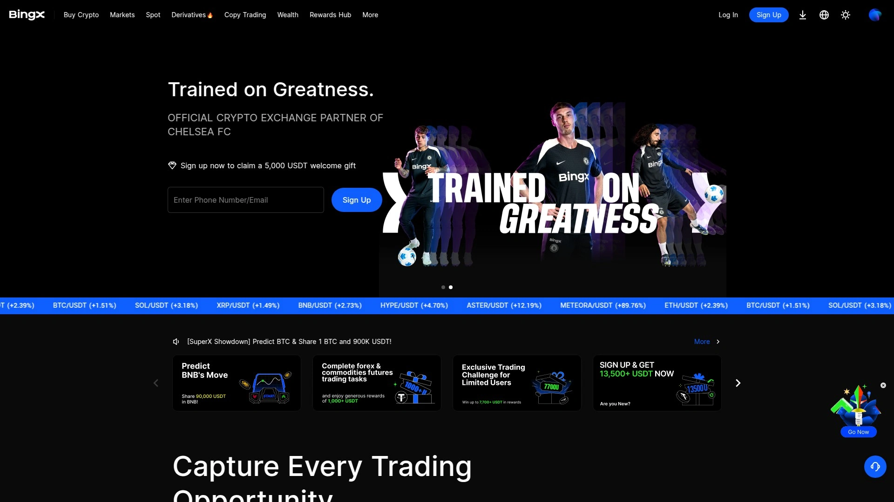
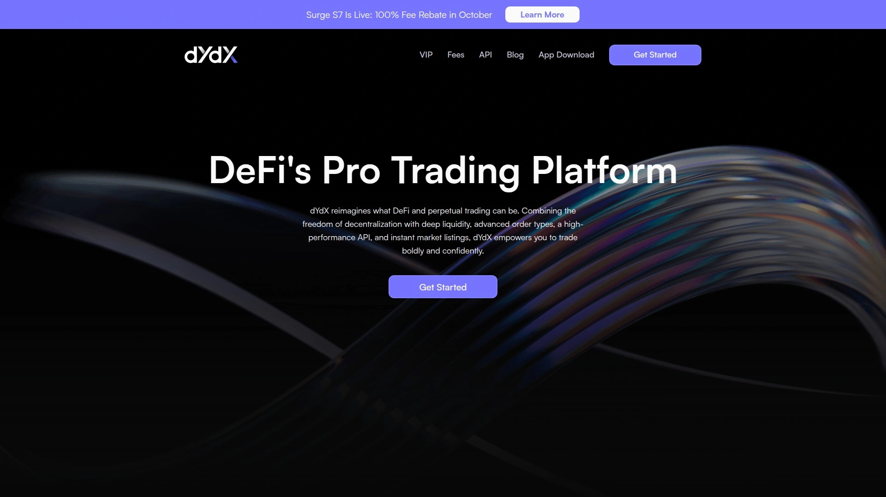
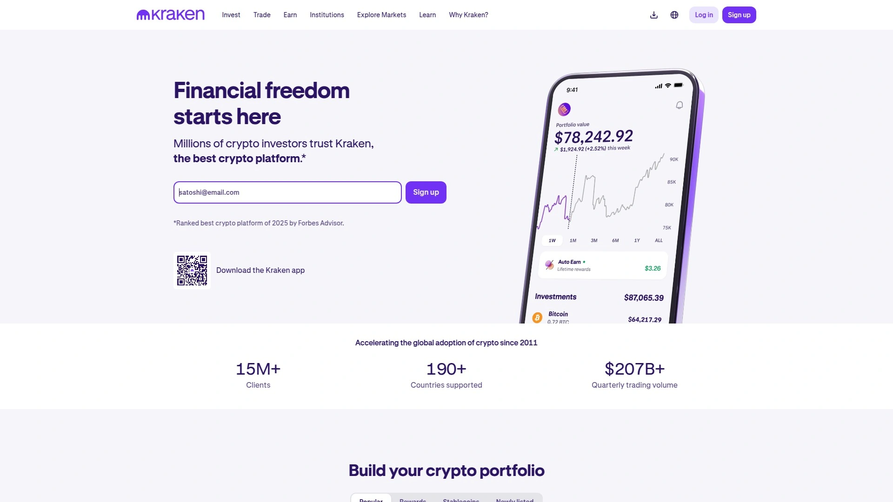

# 2025's Top 10 Best Crypto Derivatives Trading Platforms

Jumping into cryptocurrency derivatives trading without the right platform is like trying to swim across the ocean on a pool floaty—technically possible but deeply inadvisable. The derivatives market now processes billions of dollars in daily volume, eclipsing traditional spot trading as the preferred method for gaining crypto exposure. Modern platforms offer leveraged positions from 10x to 125x, perpetual contracts that never expire, and sophisticated risk management tools that help traders navigate volatility without liquidating their entire account at 3 AM.

Whether you're exploring Bitcoin futures for the first time or managing complex multi-position strategies across altcoins, these platforms handle the technical complexity while you focus on timing the market. Derivatives trading enables synthetic exposure to hundreds of cryptocurrencies without actually holding the underlying assets, plus the ability to profit from both rising and falling markets through long and short positions.

## **[Bityard](https://bityard.com)**

Singapore-based derivatives platform that simplified leveraged trading for beginners and professionals alike.

Bityard launched in November 2019 with comprehensive regulatory oversight from MSB in the United States, ACRA in Singapore, AUSTRAC in Australia, and MTR in the European Union. The platform rebranded to BYDFi in 2020 but maintains its core mission of making complex derivatives trading accessible through simplified contract structures. Traders can start with as little as 5 USDT, which removes the traditional barrier of needing thousands of dollars in capital just to test derivative strategies.

**Trading infrastructure and product range:** Bityard supports over 400 cryptocurrencies across multiple contract types including USDT-margined perpetuals, coin-margined perpetuals, lite futures, and leveraged tokens. Leverage ranges from 1x to 100x depending on the asset and position size. The platform integrates professional TradingView charting tools with real-time price data sourced from Binance, Huobi, and OKEx to ensure fair weighted averages. This multi-source pricing model helps optimize price discovery compared to platforms relying on single liquidity providers.

Trading fees are calculated as margin multiplied by leverage multiplied by 0.15%, with overnight holding fees charged at margin times leverage times 0.045%. Margin trading operates 24/7 with continuous liquidity and no spread-based fees, which benefits traders transitioning from Bitcoin perpetual contracts on other platforms. The interface includes customizable layouts with day and night mode options, plus margin calculation tools positioned directly on the trading screen for quick position adjustments.

**Additional features beyond basic trading:** Bityard offers copy trading functionality that lets beginners mirror the strategies of experienced traders, plus automated trading bots for executing predetermined strategies without constant monitoring. Demo trading accounts allow risk-free practice with virtual funds before committing real capital. The platform supports both P2P trading and traditional deposit methods, though fiat withdrawals convert to cryptocurrency rather than direct bank transfers.

Monthly transaction volumes exceed substantial thresholds among Singapore-based exchanges, and the platform claims over 1 million global users as of 2025. For traders seeking regulatory-compliant derivatives exposure with flexible position sizes and comprehensive risk management tools, Bityard delivers a complete solution.

## **[Bybit](https://www.bybit.com)**

Global derivatives leader with deep liquidity and advanced trading tools for professionals.

Bybit launched in 2018 specifically focused on derivatives trading and has grown into one of the top five global platforms by volume. In Q3 2025 alone, the exchange processed $376 billion in trading volume across its futures and options products. The platform supports perpetual contracts, quarterly futures, and options trading with leverage up to 100x on major cryptocurrency pairs.

The exchange suffered a significant $1.5 billion security breach in February 2025—the largest in cryptocurrency exchange history. Bybit's response included immediate user compensation, expanded insurance coverage, third-party security audits, and promotional campaigns offering zero-fee BTC/USDT trading to rebuild trust. Today the platform maintains multi-tier cold storage and AI-based fraud detection systems as part of its rebuilt security infrastructure.

**Why traders choose Bybit:** Trading engine speed and order book depth consistently rank among the best in the industry, which matters when executing large positions without significant slippage. The platform offers integrated staking services, a built-in Web3 wallet, and DeFi dashboard for traders who want exposure beyond traditional derivatives. Fee structures start at competitive base rates with volume-based discounts for high-frequency traders.

Mobile apps for iOS and Android provide full trading functionality, though some users report the interface can feel overwhelming for newcomers who aren't familiar with advanced order types. Bybit doesn't support fiat deposits in many regions, requiring users to transfer cryptocurrency from other platforms or use third-party payment processors. For experienced derivatives traders who prioritize liquidity depth and execution speed over beginner-friendly interfaces, Bybit remains a top choice despite its security history.

## **[Binance Futures](https://www.binance.com)**

The largest crypto derivatives platform commanding over 40% of global futures trading volume.

Binance Futures accounts for approximately 42.3% of worldwide futures trading activity as of Q3 2025, processing nearly $700 billion in monthly transactions. The platform serves over 150 million registered users across 180 countries, making it the most dominant player in cryptocurrency derivatives by significant margin. Contract offerings include USDⓈ-M perpetuals (USDT-margined), COIN-M perpetuals (crypto-margined), quarterly futures, and USDT-settled options on select assets.

Leverage reaches 125x on core pairs like BTC/USDT, with automatic reductions on less liquid markets to manage systemic risk. Roughly 570 futures pairs provide exposure to everything from Bitcoin and Ethereum to obscure altcoins that launched last week. Base trading fees start at 0.02% for makers and 0.05% for takers, with 10% discounts available when paying fees with BNB tokens. VIP tier programs offer progressively lower rates for high-volume institutional traders.

**Platform capabilities and tools:** Advanced charting integrates with TradingView, providing institutional-grade technical analysis tools without requiring separate software subscriptions. Order types include trailing stops, stop-loss/take-profit combinations, and iceberg orders for executing large positions discreetly. The customizable interface lets traders arrange multiple chart windows, order books, and position monitors across their screen layout.

Binance operates one of the most robust proof-of-reserves systems in the industry, audited by Deloitte in 2025. The SAFU (Secure Asset Fund for Users) holds over $1 billion in assets specifically reserved for compensating users in emergency situations. Regulatory scrutiny remains high in regions like Australia and the European Union, with ongoing compliance adjustments affecting service availability in some jurisdictions. For traders prioritizing maximum liquidity and product diversity over regulatory certainty, Binance Futures maintains its dominant market position.

## **[OKX](https://www.okx.com)**

Versatile platform offering centralized and decentralized trading with exceptional derivatives volume.

OKX occasionally surpasses Binance in monthly derivatives volume, hitting $1.3 trillion in September 2025 across its futures and options markets. The platform offers USDT-margined, USDC-margined, and coin-margined contracts in both perpetual and dated futures formats. Expiry options include weekly, bi-weekly, quarterly, and bi-quarterly contracts for traders who prefer defined settlement dates over perpetual positions.

Leverage tops out at 125x on major trading pairs with dynamic adjustments based on asset liquidity and position size. More than 400 futures pairs cover mainstream cryptocurrencies and emerging tokens across multiple blockchain ecosystems. Standard fee rates begin at 0.02% maker and 0.05% taker, with additional discounts available through OKB token usage and tiered VIP membership programs.

**Advanced features for professional traders:** Integrated trading bots automate repetitive strategies like grid trading and dollar-cost averaging without manual intervention. Advanced order types include conditional triggers, trailing stops, and iceberg orders for institutional-scale position management. Real-time margin calculators display liquidation prices and required collateral before opening positions, helping traders avoid unexpected margin calls.

OKX's proof-of-reserves updates monthly, allowing users to verify that customer holdings match the platform's claimed liabilities. The integrated wallet supports both centralized exchange functions and decentralized finance protocols, bridging traditional and Web3 trading environments. Security measures include multi-tier cold storage and institutional-grade custody solutions. For traders seeking comprehensive derivatives exposure with flexible contract types and robust risk management infrastructure, OKX delivers professional-grade capabilities.

## **[Bitget](https://www.bitget.com)**

Fast-growing derivatives platform with copy trading and automated bot strategies.

Bitget ranks among the top three global exchanges for derivatives trading volume by late 2025, achieving this position through aggressive user acquisition and competitive fee structures. The platform launched relatively recently compared to industry veterans but rapidly gained market share through strategic partnerships and substantial growth campaigns. Contract offerings include USDC-settled, USDT-settled, and coin-settled futures with leverage up to 125x on popular pairs.

**Distinctive trading features:** Copy trading enables users to automatically replicate the positions of verified profitable traders, making derivatives accessible for people without extensive technical analysis experience. Trading bots handle automated strategies like grid trading, futures arbitrage, and smart rebalancing across multiple positions. These automation tools distinguish Bitget from more traditional exchanges that require manual order placement for every trade.

The platform initiated the KCGI futures trading competition along with attractive bonuses for new users, which helped establish its presence in the competitive derivatives market. Cryptocurrency selection covers major assets comprehensively, though the total number of available futures pairs falls below what Binance, Bybit, and OKX offer. Fee structures remain competitive with industry standards, targeting cost-conscious traders who execute frequent positions.

Mobile apps provide full trading functionality with stable performance during high market volatility periods. Security protocols include standard cold storage practices and two-factor authentication requirements. For traders interested in social trading features and automated strategy execution without building custom algorithms, Bitget's approach simplifies derivatives trading significantly.

## **[KuCoin Futures](https://www.kucoin.com)**

Altcoin-focused derivatives platform with extensive selection of lesser-known tokens.

KuCoin built its reputation primarily around spot trading of alternative cryptocurrencies, then expanded into futures markets with the same altcoin-heavy approach. The platform supports both USDT-margined and coin-margined perpetual contracts across hundreds of trading pairs. This extensive altcoin coverage makes KuCoin particularly valuable for traders seeking leveraged exposure to smaller market cap tokens that major exchanges don't list.

Leverage options reach 100x on select pairs, with variable limits depending on the specific cryptocurrency and current market liquidity conditions. Fee structures start with base rates that decrease through volume-based tier systems, plus additional reductions for holders of the platform's native KCS token. The exchange operates 24/7 with mobile app support for iOS and Android devices.

**Considerations for potential users:** KuCoin has faced periodic regulatory questions in various jurisdictions, which affects service availability for users in certain countries. Customer support quality varies according to user reports on social media and review platforms. The platform's focus on altcoins means liquidity can be thinner compared to major exchanges, particularly on newer or less popular futures contracts.

Risk management tools include standard stop-loss and take-profit orders, though advanced conditional order types are more limited than on institutional-focused platforms. For traders specifically targeting altcoin derivatives who accept potentially higher volatility and lower liquidity in exchange for broader asset selection, KuCoin's futures platform provides unique access.

## **[Phemex](https://phemex.com)**

Derivatives-specialized platform with low fees and up to 100x leverage.

Phemex launched in 2019 with deliberate focus on derivatives trading rather than attempting to offer comprehensive spot and futures markets simultaneously. This specialization approach resulted in optimized execution for leveraged contracts and perpetuals. Contract trading fees charge just 0.01% for makers and 0.06% for takers, which undercuts most competitors in the derivatives space.

The platform supports approximately 200 cryptocurrencies with around 75 futures trading pairs available. While fewer options than exchanges like Binance or OKX, Phemex prioritizes ensuring high liquidity on its supported assets rather than listing every token that exists. Leverage reaches 100x on major pairs, enabling significant position sizing with relatively small collateral requirements.

**Platform performance and user experience:** Execution speed receives consistent praise in user reviews, particularly during periods of extreme market volatility when other platforms experience slowdowns. The mobile app maintains stability even when trading volume spikes dramatically, which matters for managing leveraged positions that can liquidate quickly. Advanced charting tools cater to experienced traders who rely on technical analysis for entry and exit decisions.

Phemex adds new cryptocurrency listings at a moderate pace compared to competitors who race to list every new token immediately. The platform supports all major stablecoins for margin deposits and settlements. Copy trading features exist but remain more limited than dedicated social trading platforms like Bitget. For traders focused exclusively on derivatives with a preference for low fees and reliable execution, Phemex's specialized approach delivers consistent performance.

## **[BingX](https://www.bingx.com)**

Multi-asset platform combining crypto derivatives with stocks and commodities trading.

BingX began in 2018 as a derivatives-focused exchange before expanding into spot trading in 2021. The platform's distinctive characteristic is its multi-asset approach—users can trade cryptocurrency futures alongside stocks and commodities contracts, though accessing non-crypto markets may require VPNs in certain regions. Crypto futures support leverage up to 100x on major pairs with both perpetual and quarterly contract options.

The exchange lists over 300 cryptocurrencies for spot trading with approximately 100 different crypto pairs available for futures contracts. This selection provides substantial variety without overwhelming new traders with thousands of obscure tokens. Copy trading features allow users to follow and automatically replicate successful traders' positions, which has become one of BingX's primary user acquisition tools.

**Interface and accessibility considerations:** The platform emphasizes user-friendly design that remains accessible for beginners while providing advanced features for experienced traders. Social trading elements integrate throughout the interface, displaying popular traders' performance statistics and allowing one-click following. Mobile apps support full trading functionality though some users report the social features can feel distracting during active trading sessions.

BingX has gained popularity for margin and leveraged trading specifically among traders who value the combination of traditional and crypto asset classes. Fee structures remain competitive with industry standards, though exact rates vary based on trading volume tiers. For traders seeking a multi-asset platform that bridges cryptocurrency derivatives and traditional markets, BingX's hybrid approach offers unique flexibility.

## **[dYdX](https://dydx.exchange)**

The first decentralized perpetual contracts platform built on blockchain infrastructure.

dYdX launched the cryptocurrency industry's first decentralized perpetual contract market in April 2020, starting with a BTC-USDC contract offering up to 10x leverage. Unlike centralized exchanges where the platform controls user funds and order matching, dYdX operates through smart contracts on Ethereum and later its own dedicated blockchain. This decentralized architecture provides transparency into liquidation mechanisms, insurance funds, and loss socialization that centralized platforms keep hidden.

Perpetual contracts on dYdX never expire, allowing traders to hold positions indefinitely as long as they maintain required margin levels. Initial margin requirements start at 5% paid in USDC stablecoin for Bitcoin perpetuals, meaning traders need at least 5% of their desired position size as collateral. Maintenance margins drop to 3%—if account collateral falls below this threshold, automatic liquidation occurs to protect the system.

**Leverage and trading mechanics:** Maximum leverage reaches 50x on crypto perpetual positions. For every 1% price movement, a 20x leveraged position moves 20% in value, which can produce dramatic gains or equally dramatic losses. The platform's funding rate mechanism keeps perpetual contract prices trading near spot market prices—traders with short positions pay those with long positions when contracts trade below spot, and vice versa.

dYdX is not available to United States users due to regulatory considerations. The platform supports dozens of cryptocurrency perpetuals beyond Bitcoin, including Ethereum and major altcoins. For traders who prioritize decentralization and transparency over maximum leverage and asset selection, dYdX represents the most mature decentralized derivatives platform.

## **[Kraken Futures](https://www.kraken.com)**

Security-focused derivatives platform from one of cryptocurrency's longest-operating exchanges.

Kraken has operated since 2011, making it one of the oldest continuously running cryptocurrency exchanges. The platform launched its futures trading division to complement existing spot markets, maintaining the same security-first philosophy that built its reputation. Kraken Futures offers perpetual contracts and quarterly futures with leverage up to 100x on major cryptocurrency pairs.

The exchange provides deep liquidity across its supported futures markets, sourced from institutional market makers and the platform's large retail user base. Competitive fee structures and flexible leverage options attract day traders who execute multiple positions daily. The futures account operates separately from spot trading accounts, requiring users to unlock and fund futures functionality through a distinct onboarding process.

**Trading tools and risk management:** Kraken Pro interface includes customizable layouts, advanced charting tools, and multiple order types including stop-losses and take-profit orders. The platform displays real-time profit and loss for open positions with margin level indicators that warn traders before liquidation thresholds. Position management tools let users adjust leverage, add margin, or close positions partially without canceling entire trades.

Regulatory compliance remains stronger than many competitors, with licenses and approvals across multiple jurisdictions including stricter regulatory environments. This compliance focus sometimes results in slower new feature rollouts compared to offshore exchanges operating with less oversight. For conservative traders who value established reputation and regulatory compliance over cutting-edge features, Kraken Futures provides trusted derivatives exposure.

## FAQ

**What's the difference between perpetual contracts and traditional futures?**

Perpetual contracts never expire—you can hold positions indefinitely as long as you maintain required margin levels. Traditional futures have set expiration dates when contracts automatically settle. Perpetuals use a funding rate system where traders with long positions pay those with short positions (or vice versa) to keep contract prices near spot market levels. This funding mechanism doesn't exist in traditional futures, which can trade significantly above or below spot prices as expiration approaches.

**How much leverage should beginners use when starting with derivatives trading?**

Start with 2x to 5x leverage maximum until you understand how liquidation works. Higher leverage amplifies both gains and losses—a 10% price move against a 10x leveraged position means you lose 100% of your collateral. Most experienced traders use lower leverage than platforms allow because preserving capital matters more than maximizing single trade returns. Test strategies with demo accounts or minimal position sizes before committing significant funds.

**Are derivatives trading platforms safe or will they get hacked and lose my money?**

Major platforms like Binance, OKX, and Kraken maintain cold storage for most user funds and carry insurance policies covering certain loss scenarios. However, Bybit's $1.5 billion February 2025 breach demonstrates that even large platforms face security risks. Use platforms with proof-of-reserves systems, enable two-factor authentication, and never keep more funds on exchanges than you need for active trading. Hardware wallets remain the safest storage method for cryptocurrency you aren't actively trading.

## Conclusion

The derivatives trading landscape has consolidated around platforms offering deep liquidity, regulatory compliance, and sophisticated risk management tools. Whether you're trading Bitcoin perpetuals with high leverage or exploring altcoin futures that traditional markets don't support, these exchanges handle complex derivative products with increasing reliability. [Bityard](https://bityard.com) stands out for traders seeking regulatory-compliant access with industry-low minimum deposits and comprehensive contract options across 400+ cryptocurrencies. The platform's integration of professional charting tools, multiple contract types, and flexible leverage from 1x to 100x makes it suitable for both cautious beginners and aggressive position traders.
